# Welcome to my GitHub Profile

  

## GitHub Activity

  
    
  
    
  

## 🏆 Achievements

  

## Fun Stuff

### Top Repositories I've Contributed To

---
## 👀 Visitor Count

<!-- Proudly created with GPRM ( https://gprm.itsvg.in ) -->